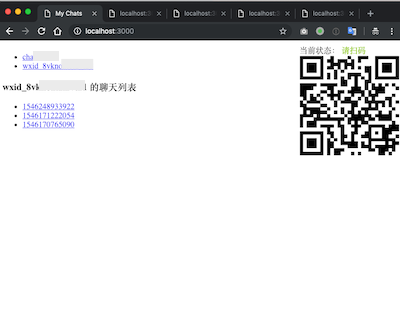
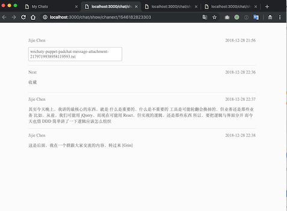
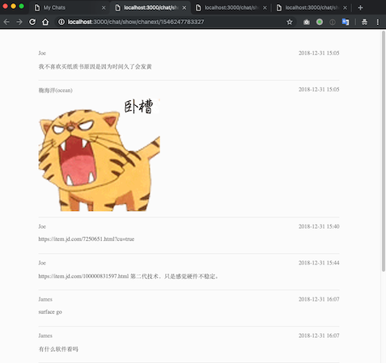

dotnet club chaty
=========

在微信里聊的嗨翻天之后，微信里的聊天内容其实有更多价值。你可能希望珍藏这些记忆，可能希望转发给更多互联网上的人分享……

[dotnet club](https://github.com/jijiechen/dotnetclub) 有一样的需求，我们希望把人们散落在各个技术群里的讨论沉淀下来，留给没有参与讨论的其他人使用，让技术讨论的效用更深远，所以我们开发了这个项目。

dotnet club chaty 是帮助你导出这些聊天记录的利器：

* 用微信个人号登录
* 就像与好友聊天那样简单
* 导出的结果可以用于分享、打印
* 结构化的数据，方便二次使用

目前本项目处于比较早期的试验阶段，基底层是基于 [Wechaty](https://github.com/Chatie/wechaty) 提供的技术。


体验步骤：

1. 在本地准备 [Node.js](https://nodejs.org/) 10 的开发环境
2. 用 Git 拉取项目的代码，用 Yarn 或者 npm 安装依赖包
3. 运行代码，打开浏览器，访问 http://localhost:3000
4. 点击界面右上角的“启动”，扫码并登录自己的微信号（注意，你电脑上已登录的微信号会退出）
5. 让别人给你“合并转发”一些聊天记录看看吧

命令行如下：

```sh
git clone https://github.com/jijiechen/dotnetclub-chaty.git
yarn install   # npm install
npm run start
```


下面是运行截图：








本项目目前尚处于开发早期，接下来将开发的功能：

1. 跟随 Wechaty 的节奏进一步完善对 Image、Video 和 Attachment 等各种类型消息的处理
2. 支持与第三方应用的集成和用户映射
3. 工程化实践：自动化测试，自动发布
4. 支持外部存储，日志管理等

热切地期待你能加入到开发过程中来。

本项目采用 MIT 协议开源。


